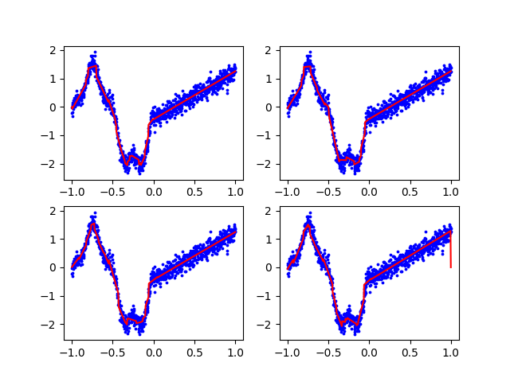

<!--
SPDX-FileCopyrightText: 2025 Michael Heider <michael.heider@uni-a.de>, Helena Segherr, Jonathan Wurth 

SPDX-License-Identifier: CC-BY-4.0
-->

<!-- Replace the comment above with your licence information for your problem
statement. Consider all copyright holders and contributors. -->

<!-- According to the copyright and licensing policy of ROAR-NET original
problem statements contributed to this repository shall be licensed under the
CC-BY-4.0 licence. In some cases CC-BY-SA-4.0 might be accepted, e.g., if the
problem is based upon an existing problem licensed under those terms. Please
provide a clear justification when opening the pull request if the problem is
not licensed under CC-BY-4.0 -->

# LCS Solution Composition

Michael Heider, Universität Augsburg, Germany  
Helena Stegherr, Universität Augsburg, Germany  
Jonathan Wurth, Universität Augsburg, Germany

<!-- Put two empty spaces at the end of each author line except the last for
proper formatting -->

Copyright 2025 the authors.

This document is licensed under CC-BY-4.0.

<!-- Complete the above accordingly. Copyright and licensing information must be
consistent with the comment at the beginning of the markdown file -->

## Introduction

Learning Classifier Systems (LCSs) [5] are a type of evolutionary machine 
learning algorithm that constructs solutions to the learning task as a finite 
set of rules each approximating a share of the input space. Some LCSs separate 
the discovery of rules from the final composition of the model returned by the 
training process, e.g. SupRB [1, 2] https://doi.org/10.1145/3520304.3529014 
or HEROS [6] https://doi.org/10.1145/3712256.3726461.

This problem statement describes the combinatorial optimization problem that
both systems have to solve to provide an accurate yet compact solution.


## Task

Given a set of rules, select a minimal subset that can still make good
predictions.

## Detailed description

It is a non-linear subset selection optimization problem over local regression 
rules where the error term depends on the weighted mixture of predictions 
from selected rules. 

The rules are precomputed and remain fixed during solution composition.

Given

- Training data $(X, y)$ with input $X \in \mathbb{R}^{n \times d}$ and target $y \in \mathbb{R}^n$
- Rule pool $\mathbf{R} = \{r_1, r_2, ..., r_k\}$ with $k$ rules

where each rule $r_i$ has

- Binary match vector: $\mathbf{m}_i \in \{0,1\}^n$ where $m_{ij} = 1$ if rule $i$ matches sample $j$
- Local prediction: $\hat{y}_{ij} \in \mathbb{R}$ (only defined when $m_{ij} = 1$)
- Experience: $e_i = \sum_{j=1}^{n} m_{ij}$ (number of matched samples)
- Error: $\varepsilon_i = \text{MSE}(y_i, \hat{y}_i)$ on its matched data

find the set of rules $\mathbf{g}^*$ that minimizes the prediction error while keeping the set as small as possible:

$$
f(\mathbf{g}) = \frac{(1 + \alpha^2) \cdot PA(\mathbf{g}) \cdot CN(\mathbf{g})}{\alpha^2 \cdot PA(\mathbf{g}) + CN(
\mathbf{g})} \,,
$$

$$
\mathbf{g}^* \in \arg\max_{\mathbf{g}} f(\mathbf{g})
$$

where $\mathbf{g} \in \{0,1\}^k$ represents a rule set, with $g_i = 1$ if $r_i$ is included, and $\alpha = 0.3$ is the
scalarization weight that decides relative influence of error and rule set size.

### Rule Set Prediction

For training sample $j$, the prediction of the rule set is

$$
\hat{y}_j(\mathbf{g}) = \frac{\sum_{i=1}^{k} g_i \cdot m_{ij} \cdot \tau_i \cdot \hat{y}_{ij}}{\sum_{i=1}^{k} g_i \cdot
m_{ij} \cdot \tau_i} \,,
$$

where

- $\tau_i = \frac{1}{\varepsilon_i} \cdot e_i$ is the weight for rule $i$
- If denominator is 0 (no rule matches), then $\hat{y}_j(\mathbf{g}) = \frac{1}{n}\sum_{i=1}^n y_i$ (mean training
  target)

### Rule Set Error

The error $\varepsilon$ is inverted using an exponential transformation:

$$
\varepsilon(\mathbf{g}) = \frac{1}{m} \sum_{j=1}^{m} (y_j - \hat{y}_j(\mathbf{g}))^2
$$

$$
PA(\mathbf{g}) = \exp(-2 \cdot \varepsilon(\mathbf{g}))
$$

### Rule Set Size

The rule set size is normalized and inverted:

$$C(\mathbf{g}) = \sum_{i=1}^{k} g_i$$

$$CN(\mathbf{g}) = 1 - \frac{C(\mathbf{g})}{k}$$

## Instance data file

The instance file is provided in JSON format.

Its first element "alpha" describes the weight of solution quality and solution length
in the scalarized fitness function.

The "target_values" are the ground truth from the original dataset of the supervised
learning task.

The final element is the "rule_pool", which is a list of rules.
Each rule is made up of "local_predictions", which is a mapping of dataset entry and local 
prediction (Hint: ideally, the rule would predict the same value as in target values, but 
explainable local models usually make small deviations during fitting).
When no value is suggested for a target instance, this means that a rule cannot be applied here.
The second part of each rule is "tau", which is an estimate of its quality and how much it 
should contribute towards global prediction.

## Solution file

The solution file is provided in JSON format.

The "rule_set" is a vector of the length of rules in the "rule_pool".
A "0" denotes the rule at this index not being present in the solution.
A "1" denotes the respective rule being present.

## Example

This example of the problem was generated using the SupRB [1, 2] repository: https://github.com/heidmic/suprb

The solution to this example was found using a relatively standard genetic algorithm although multiple other approaches have been explored for SupRB in the past [3, 4].


### Instance

```json
{
  "alpha": 0.3,
  "target_values": [
    1.2,
    2.3,
    1.8,
    3.1,
    2.5
  ],
  "rule_pool": [
    {
      "local_predictions": {
        "0": 1.3,
        "1": 2.1,
        "3": 3.0
      },
      "tau": 20.0
    },
    {
      "local_predictions": {
        "2": 1.9,
        "4": 2.4
      },
      "tau": 25.0
    },
    {
      "local_predictions": {
        "0": 1.2,
        "1": 2.3,
        "2": 1.8,
        "3": 3.1
      },
      "tau": 40000.0
    }
  ]
}
```

### Solution

```json
{
  "rule_set": [
    1,
    1,
    0
  ]
}
```


### Explanation



This is a 1-D Higdon-Gramacy-Lee function with a noise-level of 0.1 (normally distributed).
It is sampled 1000 times (blue dots), the red lines correspond to localized rule predictions
to approximate the function.
It was selected as a subset of a larger collection of rules.

The image shows solutions to four different instances.

In the "data" folder, there are five different instances with five corresponding solutions available.

## Acknowledgements

This problem statement is based upon work from COST Action Randomised
Optimisation Algorithms Research Network (ROAR-NET), CA22137, is supported by
COST (European Cooperation in Science and Technology).

<!-- Please keep the above acknowledgement. Add any other acknowledgements as
relevant. -->

## References

[1] Michael Heider, Helena Stegherr, Jonathan Wurth, Roman Sraj, and Jörg Hähner. 2022. Separating Rule Discovery and Global Solution Composition in a Learning Classifier System. In Genetic and Evolutionary Computation Conference Companion (GECCO ’22 Companion). https://doi.org/10.1145/3520304.3529014

[2] Michael Heider, Helena Stegherr, Roman Sraj, David Pätzel, Jonathan Wurth and Jörg Hähner. 2023. SupRB in the context of rule-based machine learning methods: a comparative study. Applied Soft Computing 147, 110706. DOI: 10.1016/j.asoc.2023.110706

[3] Jonathan Wurth, Michael Heider, Helena Stegherr, Roman Sraj, and Jörg Hähner. 2022. Comparing different Metaheuristics for Model Selection in a Supervised Learning Classifier System. In Genetic and Evolutionary Computation Conference Companion (GECCO ’22 Companion). https://doi.org/10.1145/3520304.3529015

[4] Michael Heider, Maximilian Krischan, Roman Sraj and Jörg Hähner. 2024 Exploring Self-Adaptive Genetic Algorithms to Combine Compact Sets of Rules. In Proceedings of the 2024 IEEE Congress on Evolutionary Computation (CEC). https://doi.org/10.1109/CEC60901.2024.10612101.

[5] Michael Heider, David Pätzel, Helena Stegherr, Jörg Hähner. 2023. A Metaheuristic Perspective on Learning Classifier Systems. In: Eddaly, M., Jarboui, B., Siarry, P. (eds) Metaheuristics for Machine Learning. Computational Intelligence Methods and Applications. Springer, Singapore. https://doi.org/10.1007/978-981-19-3888-7_3

[6] Gabe Lipschutz-Villa, Harsh Bandhey, Ruonan Yin, Malek Kamoun, Ryan Urbanowicz. 2025. Rule-based Machine Learning: Separating Rule and Rule-Set Pareto-Optimization for Interpretable Noise-Agnostic Modeling GECCO '25: Proceedings of the Genetic and Evolutionary Computation Conference. 407-415.
